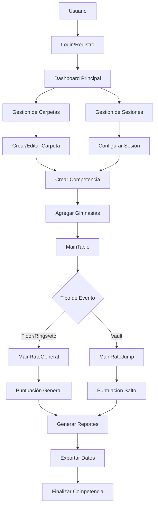
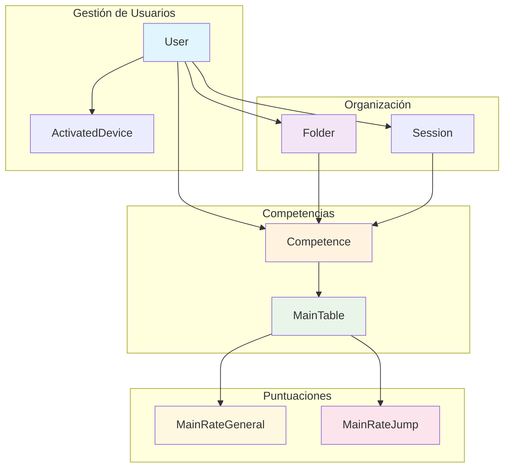

# Diagrama de Base de Datos - Gymnastics Judge App

## Estructura General
La aplicación utiliza AsyncStorage para persistencia local, con 8 tablas principales que manejan usuarios, competencias, gimnastas y puntuaciones.

## Diagrama ERD (Entity Relationship Diagram)

```mermaid
erDiagram
    User {
        int id PK
        string username
        string password
        string rol
    }
    
    ActivatedDevice {
        int id PK
        string deviceId
        string activationKey
        number activatedAt
        int createdBy FK
    }
    
    Folder {
        int id PK
        int userId FK
        string name
        string description
        boolean type
        string date
        boolean filled
    }
    
    Session {
        int id PK
        boolean gender
        int userId FK
    }
    
    Competence {
        int id PK
        string name
        string description
        string date
        string type
        boolean gender
        int sessionId FK
        int folderId FK
        int userId FK
        int numberOfParticipants
    }
    
    MainTable {
        int id PK
        int competenceId FK
        int number
        string name
        string event
        string noc
        string bib
        number j
        number i
        number h
        number g
        number f
        number e
        number d
        number c
        number b
        number a
        number dv
        number eg
        number sb
        number nd
        number cv
        number sv
        number e2
        number d3
        number e3
        number delt
        number percentage
    }
    
    MainRateGeneral {
        int id PK
        int tableId FK
        boolean stickBonus
        number numberOfElements
        number difficultyValues
        number elementGroups1
        number elementGroups2
        number elementGroups3
        number elementGroups4
        number elementGroups5
        number execution
        number eScore
        number myScore
        number compD
        number compE
        number compSd
        number compNd
        number compScore
        string comments
        string paths
        number ded
        number dedexecution
        string vaultNumber
        string vaultDescription
    }
    
    MainRateJump {
        int id PK
        int tableId FK
        boolean stickBonus
        number vaultNumber
        number startValue
        string description
        number execution
        number myScore
        number compD
        number compE
        number compSd
        number compNd
        number score
    }

    %% Relaciones
    User ||--o{ ActivatedDevice : "createdBy"
    User ||--o{ Folder : "userId"
    User ||--o{ Session : "userId"
    User ||--o{ Competence : "userId"
    
    Folder ||--o{ Competence : "folderId"
    Session ||--o{ Competence : "sessionId"
    
    Competence ||--o{ MainTable : "competenceId"
    
    MainTable ||--o| MainRateGeneral : "tableId"
    MainTable ||--o| MainRateJump : "tableId"
```

## Diagrama de Flujo de Datos

## Diagrama de Arquitectura de Datos

## Descripción de Tablas

### Tabla User
- **Propósito**: Almacena información de usuarios del sistema
- **Campos clave**: 
  - `id`: Identificador único
  - `username`: Nombre de usuario único
  - `rol`: "admin" o "user"

### Tabla ActivatedDevice
- **Propósito**: Control de dispositivos activados con licencia
- **Campos clave**:
  - `deviceId`: Identificador único del dispositivo
  - `activationKey`: Clave de activación
  - `createdBy`: Usuario que activó el dispositivo

### Tabla Folder
- **Propósito**: Organización de competencias en carpetas
- **Campos clave**:
  - `type`: true=entrenamiento, false=competencia
  - `filled`: indica si la carpeta está completa

### Tabla Session
- **Propósito**: Configuración de sesiones de entrenamiento/competencia
- **Campos clave**:
  - `gender`: true=masculino, false=femenino

### Tabla Competence
- **Propósito**: Definición de competencias específicas
- **Campos clave**:
  - `type`: "Floor", "Jump", etc.
  - `numberOfParticipants`: límite de participantes

### Tabla MainTable
- **Propósito**: Datos básicos de cada gimnasta en una competencia
- **Campos clave**:
  - `number`: número del gimnasta en la competencia
  - `name`: nombre del gimnasta
  - `event`: evento específico (FX, VT, etc.)
  - Campos j-a: elementos técnicos
  - Campos de puntuación: dv, eg, sb, nd, cv, sv, etc.

### Tabla MainRateGeneral
- **Propósito**: Puntuación detallada para eventos generales (suelo, anillas, etc.)
- **Campos clave**:
  - `elementGroups1-5`: puntuación por grupos de elementos
  - `execution`: puntuación de ejecución
  - `difficultyValues`: valores de dificultad

### Tabla MainRateJump
- **Propósito**: Puntuación específica para saltos (vault)
- **Campos clave**:
  - `vaultNumber`: número del salto
  - `startValue`: valor inicial del salto
  - `description`: descripción del salto

## Relaciones Importantes

1. **User → Folder → Competence → MainTable**: Jerarquía principal de datos
2. **MainTable → MainRateGeneral/MainRateJump**: Relación 1:1 para puntuaciones
3. **User → Session → Competence**: Configuración de sesiones
4. **User → ActivatedDevice**: Control de licencias

## Consideraciones Técnicas

- **Almacenamiento**: AsyncStorage (local)
- **Claves**: Cada tabla tiene un identificador único incremental
- **Integridad**: Las relaciones se mantienen por convención, no por restricciones de BD
- **Backup**: Funciones de exportación/importación disponibles
